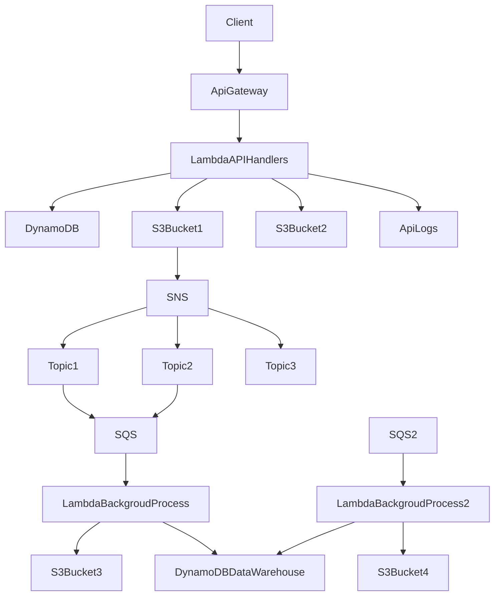

# Serverless Framework AWS NodeJS

This is a backend application based on serverless framework.
The purpose of this project is to design event driven architecture

## Specification

### Infrastructure Architecture



### Technologies

| Topic                            | Technology    |
| -------------------------------- | ------------- |
| Framework                        | Serverless    |
| Authentication and Authorization | Cognito       |
| Authentication and Authorization | Lambda        |
| Database                         | Lambda        |
| Storage                          | S3            |
| Notification                     | SNS           |
| Queuing                          | SQS           |

## Deployments

### Environments

| Environments   |
| -------------- |
| dev            |
| test           |
| production     |

### Database

First navigate to app/infrastructure/cognito

```
$ serverless deploy -s <environment>
```

### Storage

First navigate to app/infrastructure/storage

```
$ serverless deploy -s <environment>
```

### API

First navigate to app/api

```
$ serverless deploy -s <environment>
```